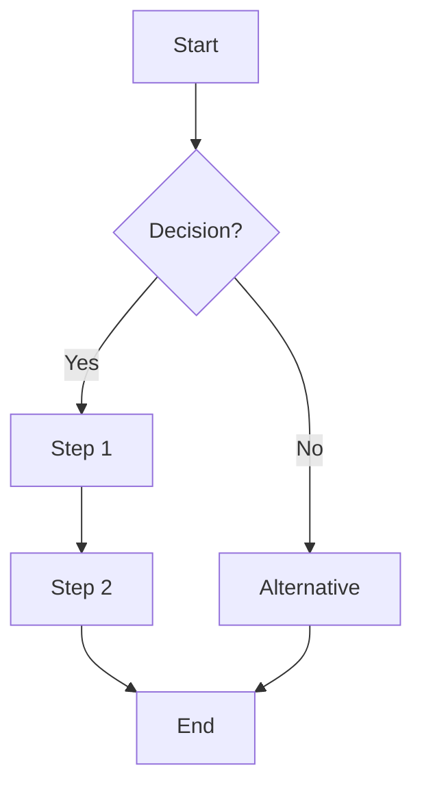

# SOP: {{process_name}}

*Note: This template defines a Standard Operating Procedure for consistent, repeatable processes. Fill all REQUIRED fields and delete instruction notes after completion.*

## Document Control

| Field | Value |
|-------|-------|
| **SOP ID** | SOP-{{NNN}} |
| **Version** | 1.0.0 |
| **Status** | [draft | review | active | deprecated] |
| **Owner** | [REQUIRED: Person/Team responsible] |
| **Approver** | [REQUIRED: Who must approve this SOP] |
| **Effective Date** | {{YYYY-MM-DD}} |
| **Review Frequency** | [Monthly | Quarterly | Annually] |
| **Next Review** | {{YYYY-MM-DD}} |

## Purpose

### Objective
[REQUIRED: What this procedure accomplishes - 1-2 sentences]

### Scope
**In Scope**:
- [REQUIRED: What is included]
- [What this covers]

**Out of Scope**:
- [REQUIRED: What is excluded]
- [What this doesn't cover]

### When to Use
[REQUIRED: Situations when this SOP should be followed]

Example: "Use this SOP when a customer requests a refund for purchases under $500"

## Roles & Responsibilities

| Role | Responsibilities | Authority Level |
|------|------------------|-----------------|
| [REQUIRED: Role name] | [What they do] | [Decision authority] |
| Executor | Performs the procedure steps | Follow SOP, escalate exceptions |
| Approver | Reviews exceptions requiring approval | Approve/deny within policy |
| Owner | Maintains and updates SOP | Update procedure, assign tasks |

## Prerequisites

### Required Access
- [REQUIRED: System/tool access needed]
- [Access requirement]

### Required Knowledge
- [[../../10-KNOWLEDGE/domains/{{domain}}/{{topic}}|Knowledge Article]]
- [Required knowledge or training]

### Required Tools
- [REQUIRED: Tool or system needed]
- [Tool name] - [[../../30-INTEGRATIONS/{{integration}}|Integration Link]]

### Required Information
*Note: Information needed before starting*
- [REQUIRED: What information must be gathered first]
- [Information needed]

## Procedure

### Overview
[REQUIRED: High-level description of the process flow - 2-3 sentences]

### Process Flow Diagram
*Note: Use Mermaid syntax for visual flow*



### Detailed Steps

#### Step 1: {{step_name}}
*Note: Break down into clear, actionable steps*

**Objective**: [What this step accomplishes]

**Actions**:
1. [REQUIRED: Specific action to take]
2. [Action with details]
3. [Action]

**Tools/Systems**:
- [System to use]

**Expected Duration**: [Time estimate]

**Validation**:
- [ ] [How to verify this step was done correctly]
- [ ] [Validation check]

**Common Issues**:
- **Issue**: [Potential problem]
  - **Resolution**: [How to fix]

#### Step 2: {{step_name}}

**Objective**: [What this step accomplishes]

**Actions**:
1. [Action]
2. [Action]

**Tools/Systems**:
- [System to use]

**Expected Duration**: [Time estimate]

**Validation**:
- [ ] [Validation check]

**Common Issues**:
- **Issue**: [Problem]
  - **Resolution**: [Fix]

#### [OPTIONAL: Additional steps as needed]

## Decision Points

### Decision 1: {{decision_name}}
*Note: Document decision criteria and outcomes*

**When**: [At what point in the process]

**Decision Criteria**:
```yaml
if:
  condition: [Specific condition]
  then: [Action to take]
  else: [Alternative action]

example:
  if: amount <= 100
  then: Auto-approve
  else: Require manager approval
```

**Decision Matrix**:
| Criteria | Condition | Action | Who Decides |
|----------|-----------|--------|-------------|
| [Criterion] | [When true] | [What to do] | [Role] |
| Amount | < $100 | Auto-approve | System |
| Amount | $100-$500 | Manager approval | Manager |
| Amount | > $500 | Director approval | Director |

### [OPTIONAL: Additional decision points]

## HITL (Human-in-the-Loop) Gates

### Approval Gate 1: {{gate_name}}

**Trigger**: [REQUIRED: When approval is needed]

**Approver**: [REQUIRED: Who must approve]

**Criteria**:
- [Approval criterion]
- [Criterion]

**SLA**: [Response time required]

**Escalation**: [Who to escalate to if SLA missed]

**Approval Process**:
1. System pauses workflow
2. Notification sent to approver
3. Approver reviews [[../../20-PROCESSES/hitl/approval-form|Approval Form]]
4. Decision recorded in [[../../70-LOGS/hitl/{{YYYY-MM-DD}}|HITL Log]]
5. Workflow resumes or terminates based on decision

### [OPTIONAL: Additional gates]

## Exception Handling

### Exception 1: {{exception_name}}

**Scenario**: [REQUIRED: When this exception occurs]

**Detection**: [How to identify this exception]

**Handling**:
1. [Step to handle]
2. [Step]

**Escalation Path**:
- **Level 1**: [Who handles first]
- **Level 2**: [Who to escalate to]
- **Level 3**: [Final escalation]

**Resolution SLA**: [Time to resolve]

### [OPTIONAL: Additional exceptions]

## Error Handling

### Error 1: {{error_name}}

**Error Message**: [Exact error text if applicable]

**Cause**: [What causes this error]

**Impact**: [Effect on process]

**Resolution**:
1. [Fix step]
2. [Step]

**Prevention**: [How to avoid in future]

**Log Location**: [[../../70-LOGS/errors/{{error_id}}|Error Log]]

## Quality Assurance

### Validation Checklist
*Note: Verify procedure was completed correctly*

- [ ] [REQUIRED: Key validation check]
- [ ] [Validation item]
- [ ] All required fields completed
- [ ] No errors encountered
- [ ] Output meets quality standards
- [ ] Documentation updated
- [ ] Stakeholders notified

### Quality Metrics

| Metric | Target | Measurement | Frequency |
|--------|--------|-------------|-----------|
| [REQUIRED: Key metric] | [Target value] | [How to measure] | [How often] |
| Success Rate | > 95% | Completed / Attempted | Daily |
| Average Time | < 30 min | Start to finish time | Weekly |
| Error Rate | < 2% | Errors / Total | Daily |

## Performance

### Time Estimates

| Step | Minimum | Average | Maximum |
|------|---------|---------|---------|
| Step 1 | [time] | [time] | [time] |
| Step 2 | [time] | [time] | [time] |
| **Total** | [time] | [time] | [time] |

### Frequency
**Expected Usage**: [How often this SOP is used]
- Daily / Weekly / Monthly / As-needed
- Estimated volume: [number] per [time period]

### Success Criteria
*Note: How to know if procedure was successful*

✅ **Success**:
- [REQUIRED: Success indicator]
- [Indicator]

❌ **Failure**:
- [Failure indicator]
- [Indicator]

## Documentation

### Required Documentation
*Note: What must be documented during/after execution*

- [ ] [REQUIRED: Document requirement]
- [ ] Execution log in [[../../70-LOGS/workflows/{{workflow_id}}|Workflow Log]]
- [ ] Results recorded in [System]
- [ ] Notifications sent to stakeholders

### Output Artifacts
*Note: What this procedure produces*

- [REQUIRED: Output or deliverable]
- [Artifact]

### Record Retention
- **Active Records**: [Duration]
- **Archive**: [Duration]
- **Destruction**: [When/if to delete]

## Training & Competency

### Training Requirements
*Note: What training is needed to execute this SOP*

- [REQUIRED: Training or certification needed]
- [[../../10-KNOWLEDGE/training/{{training_id}}|Training Material]]
- [Training requirement]

### Competency Assessment
- **Method**: [How competency is verified]
- **Frequency**: [How often re-assessment needed]
- **Passing Criteria**: [What defines competency]

## Related Documents

### Procedures
- [[../workflows/{{workflow_id}}|Related Workflow]]
- [[./{{sop_id}}|Related SOP]]

### Policies
- [[../../40-SECURITY/policies/{{policy_id}}|Relevant Policy]]
- [Policy document]

### Knowledge Base
- [[../../10-KNOWLEDGE/domains/{{domain}}/{{topic}}|Knowledge Article]]
- [Knowledge resource]

### Templates & Forms
- [[../templates/{{template_id}}|Form Template]]
- [Template]

## Continuous Improvement

### Feedback Mechanism
**How to Suggest Improvements**:
1. [Process for submitting feedback]
2. [Where to send suggestions]

**Review Process**:
- Feedback reviewed: [Frequency]
- Changes implemented by: [Owner]

### Recent Improvements
*Note: Track changes and optimizations*

| Date | Change | Reason | Impact |
|------|--------|--------|--------|
| {{YYYY-MM-DD}} | [Change made] | [Why] | [Result] |

### Known Issues
*Note: Acknowledged problems being worked on*

| Issue | Impact | Workaround | Target Fix Date |
|-------|--------|------------|-----------------|
| [Issue] | [Impact] | [Temporary fix] | {{YYYY-MM-DD}} |

## Compliance & Audit

### Regulatory Requirements
- [REQUIRED: If applicable, compliance framework]
- [Requirement]

### Audit Trail
- **What is Logged**: [What gets recorded]
- **Log Location**: [[../../70-LOGS/audit/{{log_id}}|Audit Log]]
- **Retention**: [How long logs are kept]

### Audit Checklist
*Note: What auditors will check*

- [ ] SOP followed as documented
- [ ] All approvals obtained
- [ ] Quality checks completed
- [ ] Documentation complete
- [ ] Compliance requirements met

## Version History

### Version 1.0.0 - {{YYYY-MM-DD}}
**Changes**:
- Initial SOP created
- [Change]

**Reason**: [Why this version was created]

**Approved By**: [Approver name]

### [OPTIONAL: Previous versions]
### Version 0.9.0 - {{YYYY-MM-DD}}
**Changes**:
- [Change description]

## Appendix

### Appendix A: Terminology
*Note: Define key terms*

| Term | Definition |
|------|------------|
| [Term] | [Definition] |

### Appendix B: Examples
*Note: Provide real-world examples*

#### Example 1: {{scenario_name}}
**Scenario**: [Description]

**Execution**:
1. [How it was done]
2. [Step]

**Outcome**: [Result]

### Appendix C: FAQ

**Q: {{common_question}}?**
A: [Answer]

**Q: [Question]?**
A: [Answer]

---

## Document Approval

| Role | Name | Signature | Date |
|------|------|-----------|------|
| Author | [Name] | [Signature/Approval] | {{YYYY-MM-DD}} |
| Reviewer | [Name] | [Signature/Approval] | {{YYYY-MM-DD}} |
| Approver | [Name] | [Signature/Approval] | {{YYYY-MM-DD}} |

---

*This SOP is maintained in the Personal AI Employee knowledge base.*
*For questions or suggestions, contact the SOP owner listed above.*
*Unauthorized modifications are not permitted.*
